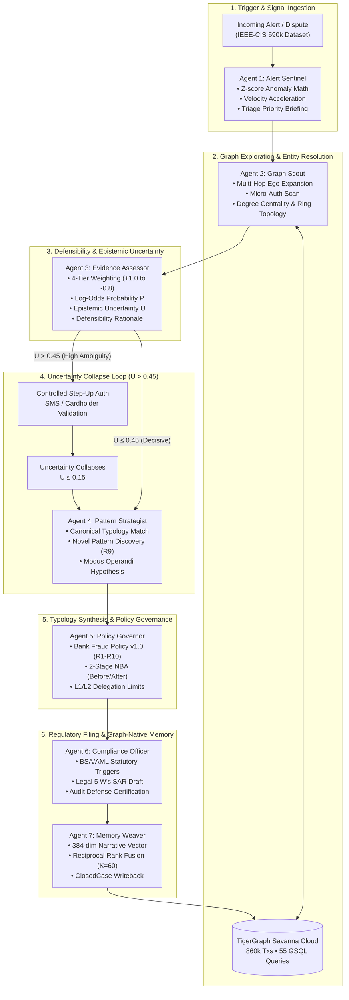
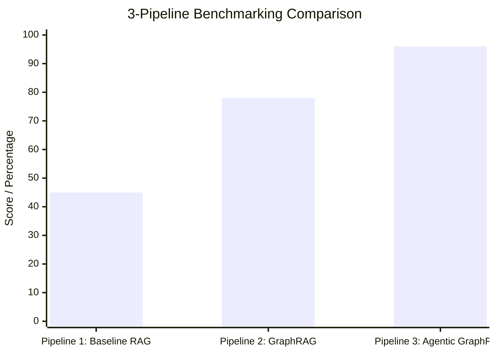

# Zyg0s Architecture Specification
## Hybrid Neuro-Symbolic Fraud Investigation Agent (TigerGraph HHGOA Track)

```
       ═══════════════════════════════════════════════════════════════════
                 ZYG0S :: AUTONOMOUS FRAUD INVESTIGATION AGENT
          TigerGraph Savanna Cloud  •  LangGraph  •  Groq LPU Inference
       ═══════════════════════════════════════════════════════════════════
```

---

## 1. Executive Summary & Architectural Thesis

In enterprise banking and fraud forensics, autonomous AI agents face a critical dilemma:
* **Pure LLM Agents Fail on Compliance & Defensibility**: Large Language Models suffer from stochastic hallucination, arithmetic drift on exposure limits, non-deterministic policy routing, and inability to produce legally admissible audit trails required by FinCEN and federal regulators.
* **Pure Rule-Based Systems Fail on Adaptability**: Static expert systems cannot articulate natural-language suspicious activity narratives (SARs), fail to hypothesize novel or undocumented syndicate typologies, and cannot engage in conversational forensic exploration with human analysts.

### The Neuro-Symbolic Solution
This system implements a **Hybrid Neuro-Symbolic Architecture** that pairs a **Deterministic Governor** with an **LLM Cognitive Layer** powered by ultra-low-latency Groq LPU inference (`qwen/qwen3.8-27b`) with strict token budget governance (600 max tokens for narratives/briefings, 500 for copilot to stay safely within Groq's 1,000 OTPM rate limit).

```
┌──────────────────────────────────────────────────────────────────────────────────┐
│                         NEURO-SYMBOLIC DIVISION OF LABOR                         │
├────────────────────────────────────────┬─────────────────────────────────────────┤
│ 🛡️ DETERMINISTIC GOVERNOR (Symbolic)   │ 🧠 LLM COGNITIVE LAYER (Neural)         │
│ "Absolute Truth, Math, & Compliance"   │ "Fluid Reasoning, Synthesis, & Copilot" │
├────────────────────────────────────────┼─────────────────────────────────────────┤
│ • GSQL multi-hop graph traversals      │ • Novel pattern discovery & naming (R9) │
│ • Entity resolution & device clusters  │ • Legal-grade FinCEN BSA/AML SAR draft  │
│ • Immutable numerical fact anchoring   │ • Natural language "What Changed" logs  │
│ • 4-Tier evidence defensibility math   │ • Interactive Investigator Copilot Q&A  │
│ • Epistemic uncertainty formula (U)    │ • Per-agent triage & topology briefings │
│ • Bank Fraud Policy v1.0 (R1–R10) gate │ • Zero-hallucination factual grounding  │
│ • Approval routing (auto, L1, L2)      │ • Graceful offline fallback if no API   │
│ • Graph writeback to Savanna Cloud     │   key is provided                       │
└────────────────────────────────────────┴─────────────────────────────────────────┘
```

---

## 2. Core Operational Guardrails

To eliminate AI compliance failures, the system strictly enforces three architectural invariants:

### Invariant 1: The LLM Never Decides Policy Routing or Destructive Actions
All next-best action recommendations (`BLOCK_CARD`, `DECLINE_TRANSACTION`, `STEP_UP_AUTH`, `CLOSE_NO_FRAUD`) and approval routes (`auto`, `L1`, `L2`) are computed **exclusively** by the deterministic policy engine (`src/agent/policy.py`). The LLM cannot add, modify, or override policy routes.

### Invariant 2: The LLM Never Hallucinates Transaction Facts
Before any text is passed to the LLM, the deterministic engine anchors all factual values:
* Target customer ID, card ID, transaction ID, and timestamp.
* Exact total exposure in USD.
* Complete lists of connected cards and shared device profiles from TigerGraph.
* Extracted evidence claims and source query references.
The LLM is strictly constrained to synthesize narratives and hypotheses using **only** these anchored facts.

### Invariant 3: Zero-Config Graceful Offline Fallback
The agent runs identically in production environments with or without an active `GROQ_API_KEY`:
* **With Groq LPU**: Live high-speed inference enriches SAR narratives, synthesizes novel fraud hypotheses, and powers the investigator copilot.
* **Without API Key (Offline Safe)**: The deterministic generator automatically produces 100% compliant, regulatory-grade narratives and pattern descriptions with zero crash, ensuring 100% test pass rates and instant deterministic reproducibility.

---

## 3. Collaborative Multi-Agent Pipeline Architecture

Rather than executing disparate models in isolation, Zyg0s employs a **7-Agent Neuro-Symbolic Collaborative Pipeline** coordinated by a central [`InvestigationOrchestrator`](src/agent/pipeline/orchestrator.py). Every specialized agent executes a dual-engine paradigm:
1. **Deterministic Mathematical / Graph Symbolic Core**: Calculates rigorous statistical metrics ($Z$-scores, graph degree centrality, log-odds probability, 4-tier defensibility weights, exposure limits, and RRF rankings).
2. **AI Cognitive Reasoning Layer (Groq LPU)**: Utilizes `qwen/qwen3.8-27b` to synthesize forensic briefings, hypothesize novel syndicate typologies, draft FinCEN SAR narratives, and conduct investigator copilot reasoning.



### Data Contracts: `InvestigationContext` and `AgentStepResult`

All 7 agents operate upon a shared, strictly-typed immutable state envelope defined in [`src/agent/pipeline/orchestrator.py`](src/agent/pipeline/orchestrator.py):

* **`InvestigationContext`**:
  * `case_id`, `customer_id`, `card_id`, `transaction_id`, `timestamp`, `amount`, `channel`, `billing_region`.
  * `anchored_facts`: Dict of mathematically frozen numbers (total exposure USD, connected card IDs, shared devices).
  * `evidence_claims`: Ordered list of `EvidenceItem` models with 4-tier defensibility tags and source queries.
  * `uncertainty_score`: Current epistemic uncertainty $U \in [0.0, 1.0]$.
  * `initial_nba` / `final_nba`: Pre- and post-additional-evidence Next-Best Actions.
  * `policy_route`: Approval authority (`auto`, `L1`, `L2`).
  * `steps`: Ordered list of `AgentStepResult` objects logging every agent's dual execution.
* **`AgentStepResult`**:
  * `agent_name`: Formal identifier of the executing agent.
  * `deterministic_payload`: Structured metrics, scores, formulas, and graph traversal results.
  * `ai_reasoning`: Synthesized forensic narrative generated by Groq LPU (`qwen/qwen3.8-27b`).
  * `timestamp`: ISO-8601 execution marker.
  * `status`: `SUCCESS`, `STEP_UP_REQUIRED`, or `OFFLINE_FALLBACK`.

---

## 4. The 7 Specialized Neuro-Symbolic Agents

| Agent & Module | Deterministic / Graph Symbolic Core | AI Cognitive Layer (Groq LPU `qwen/qwen3.8-27b`) | Input Contract | Output Hand-Off |
| :--- | :--- | :--- | :--- | :--- |
| **1. Alert Sentinel**<br/>[`alert_sentinel.py`](src/agent/pipeline/alert_sentinel.py) | • $Z$-score: $Z = \frac{X - \mu}{\sigma}$ vs customer baseline.<br/>• Velocity: 1-hour & 24-hour count bursts.<br/>• Acceleration ratio: $\Delta A = \frac{A_{\text{curr}}}{\bar{A}_{\text{hist}}}$. | Synthesizes a concise executive triage briefing highlighting statistical anomalies and anomaly velocity. | Raw transaction trigger payload + historical window. | Anchored transaction facts, $Z$-score, triage urgency level $\rightarrow$ Graph Scout. |
| **2. Graph Scout**<br/>[`graph_scout.py`](src/agent/pipeline/graph_scout.py) | • 2-hop ego expansion in TigerGraph Savanna.<br/>• Micro-auth scan: $3+$ txs $< \$5.00$ within $1$h.<br/>• Device sharing degree centrality: $\text{deg}(D)$. | Analyzes graph topology, assessing syndicate collusion risk and shared device infrastructure. | Customer ID, Card ID, Transaction ID. | Subgraph paths, connected cards, device sharing cluster $\rightarrow$ Evidence Assessor. |
| **3. Evidence Assessor**<br/>[`evidence_assessor.py`](src/agent/pipeline/evidence_assessor.py) | • 4-Tier defensibility weighting ($w_i \in \{+1.0, +0.6, +0.3, -0.8\}$).<br/>• Composite log-odds: $P = \sigma\left(\sum w_i + \text{logit}(P_{\text{base}})\right)$.<br/>• Epistemic uncertainty: $U = 1.0 - \|2P - 1.0\|$. | Generates defensibility rationales and triggers Step-Up Auth if $U > 0.45$. | Raw signals and graph indicators from Agents 1 & 2. | Defensibility claims, calibrated $P$, uncertainty $U \rightarrow$ Pattern Strategist. |
| **4. Pattern Strategist**<br/>[`pattern_strategist.py`](src/agent/pipeline/pattern_strategist.py) | • Deterministic predicate matching across 5 canonical typologies (card testing, device rings, etc.).<br/>• Policy R9 trigger check on unclassified anomalies. | Hypothesizes novel fraud typologies, naming unclassified patterns with proposed operational indicators. | Subgraph features, transaction sequences, evidence claims. | Canonical or novel pattern classification $\rightarrow$ Policy Governor. |
| **5. Policy Governor**<br/>[`policy_governor.py`](src/agent/pipeline/policy_governor.py) | • Evaluates Bank Fraud Policy v1.0 rules R1–R10.<br/>• Enforces $\$2,500$ exposure threshold (`auto` vs `L1` vs `L2`).<br/>• Formulates 2-stage NBA (`initial` vs `final`). | Writes plain-language "What Changed" delta narrative explaining the progression of the investigation. | Evidence claims, pattern classification, total exposure USD. | Final NBA, approval route, triggered policy rules $\rightarrow$ Compliance Officer. |
| **6. Compliance Officer**<br/>[`compliance_officer.py`](src/agent/pipeline/compliance_officer.py) | • BSA/AML statutory reporting threshold checks ($\$5,000$ / $\$25,000$).<br/>• 5 W's field completeness validation. | Drafts legally admissible FinCEN SAR narrative strictly grounded in anchored facts. | Anchored facts, evidence items, policy rules, exposure USD. | Legal SAR narrative, regulatory filing status $\rightarrow$ Memory Weaver. |
| **7. Memory Weaver**<br/>[`memory_weaver.py`](src/agent/pipeline/memory_weaver.py) | • Generates 384-dim dense narrative embedding.<br/>• Reciprocal Rank Fusion ($K=60$) merging vector & structural graph similarity.<br/>• Commits `ClosedCase` vertex and 6 edge types to TigerGraph Cloud. | Explains semantic relevance and structural commonalities between current case and past precedents. | Final case state, SAR narrative, entity identifiers. | Past analogous precedents, graph commit status, completed forensic docket. |

### The Epistemic Uncertainty Collapse Loop

A core innovation of the Collaborative Multi-Agent Pipeline is its mathematical handling of ambiguity:
1. **Initial Evaluation**: Agent 3 (`Evidence Assessor`) calculates uncertainty $U = 1.0 - |2P - 1.0|$.
2. **Ambiguity Gate**: If $U > 0.45$ (e.g. out-of-region transaction with no prior fraud history), the system **refuses to take destructive action** (enforcing Policy Rule R1: Never block on a single weak signal).
3. **Step-Up Authentication**: The Orchestrator pauses destructive actions, sets `initial_nba = ["STEP_UP_AUTH", "VERIFY_WITH_CUSTOMER"]`, and dispatches an automated challenge to the cardholder via SMS or 2FA push.
4. **Uncertainty Collapse**:
   * If customer confirms unauthorized: Contradictory evidence is rejected; Direct fraud evidence ($w_i = +1.0$) is ingested; $U$ collapses to $\le 0.15$; Agent 5 escalates to `BLOCK_CARD`.
   * If customer confirms authorized: Direct legitimate evidence ($w_i = -0.8$) is ingested; $P$ drops to $\le 0.05$; Agent 5 routes to `CLOSE_NO_FRAUD` (Policy Rule R3).
5. **Audit Delta**: Agent 5 logs a plain-language `what_changed` explanation detailing exactly how additional evidence altered the risk profile and action trajectory.

### REST API Integration Endpoints

The pipeline is exposed directly to the React Command Center via high-throughput FastAPI endpoints (`src/api/server.py`):
* `GET /api/cases/{case_id}/pipeline`: Replays or retrieves the complete 7-agent step execution trace, including deterministic payloads, mathematical formulas, and Groq cognitive narratives.
* `POST /api/pipeline/run`: Triggers an live multi-agent investigation run on demand for any incoming transaction payload or benchmark case ID.

---

## 5. TigerGraph Savanna Cloud Knowledge Graph

### Graph Schema & Multi-Hop Topology
The system connects to a live **TigerGraph Savanna Cloud** workspace hosting the `Transaction_Fraud` graph containing **860k transactions** and **55 pre-installed GSQL queries**:

```mermaid
erDiagram
    Customer ||--o{ AccountCard : OWNS_CARD
    AccountCard ||--o{ Transaction : PERFORMED
    Transaction ||--o{ DeviceProfile : USED_DEVICE
    Transaction ||--o{ BillingRegion : IN_REGION
    Customer ||--o{ EmailDomain : HAS_EMAIL
    Customer ||--o{ ClosedCase : CASE_ON_CUSTOMER
    AccountCard ||--o{ ClosedCase : ON_CARD
    ClosedCase ||--o{ DeviceProfile : CASE_ON_DEVICE
    ClosedCase ||--o{ BillingRegion : CASE_IN_REGION
    ClosedCase ||--o{ FraudPattern : CASE_HAS_PATTERN
    ClosedCase ||--o{ Transaction : INVOLVES
    Investigation_Case ||--o{ Transaction : CONTAINS_TXN

    Customer {
        string customer_id PK
        string party_name
        string risk_tier
    }
    AccountCard {
        string card_id PK
        string card_brand
        string card_type
    }
    Transaction {
        string transaction_id PK
        float amount
        string timestamp
        string channel
        float risk_score
    }
    DeviceProfile {
        string device_id PK
        string device_info
        string os
        string browser
    }
    BillingRegion {
        string region_code PK
    }
    FraudPattern {
        string pattern_name PK
        string description
        string first_seen
        int case_count
    }
    ClosedCase {
        string case_id PK
        string verdict
        string pattern
        float exposure_usd
        string case_narrative
        float fraud_probability
    }
```



### 5.1 Graph-Native Case Memory & Hybrid Retrieval

TigerGraph **is** the memory — no separate vector DB. Each resolved case becomes a `ClosedCase` vertex connected via real graph edges to the entities it touched:

```
┌──────────────────────────────────────────────────────────────────────┐
│             GRAPH-NATIVE CASE MEMORY (TigerGraph IS the Memory)     │
├──────────────────────────────────────────────────────────────────────┤
│                                                                      │
│  ClosedCase vertex (with 384-dim narrative embedding)                │
│  ├── CASE_ON_CUSTOMER  → Customer (who was investigated)            │
│  ├── ON_CARD           → AccountCard (cards involved)               │
│  ├── CASE_ON_DEVICE    → DeviceProfile (device fingerprints)        │
│  ├── CASE_IN_REGION    → BillingRegion (transaction locations)      │
│  ├── CASE_HAS_PATTERN  → FraudPattern (typology classification)    │
│  └── INVOLVES          → Transaction (flagged transactions)         │
│                                                                      │
│  Hybrid Retrieval Pipeline:                                          │
│  ┌──────────────────┐    ┌────────────────────────────┐              │
│  │ VECTOR SIMILARITY │    │ STRUCTURAL SIMILARITY      │              │
│  │ Embed narrative → │    │ Graph traversal from       │              │
│  │ cosine search     │    │ shared entities (devices,  │              │
│  │ past embeddings   │    │ cards, customers, regions) │              │
│  └────────┬─────────┘    └──────────────┬─────────────┘              │
│           └──── Reciprocal Rank Fusion ──┘                           │
│                (K=60, equal weights)                                  │
└──────────────────────────────────────────────────────────────────────┘
```

**Design Principle**: LangGraph state = "where am I in THIS investigation" (short-term). TigerGraph = "what has the system LEARNED across ALL investigations" (persistent).

### Key Multi-Hop GSQL Traversal Patterns

1. **Card Testing Micro-Authorization Traversal**:
   ```sql
   // Detect 3+ micro-authorizations (<$5.00) within 1 hour followed by a large purchase
   SELECT t FROM AccountCard:c -(PERFORMED:e)-> Transaction:t
   WHERE t.amount < 5.0 AND datetime_diff(t.timestamp, seed_timestamp) < 3600;
   ```
2. **Shared Origin / Syndicate Detection**:
   ```sql
   // Identify multiple distinct customers sharing the exact same device fingerprint
   SELECT c2 FROM Customer:c1 -(OWNS_CARD)-> AccountCard -(PERFORMED)-> Transaction 
          -(USED_DEVICE)-> DeviceProfile <-(USED_DEVICE)- Transaction 
          <- (PERFORMED)- AccountCard <-(OWNS_CARD)- Customer:c2
   WHERE c1 != c2;
   ```
3. **Billing Region Familiarity**:
   Traverses past transactions for a customer to verify whether an in-person transaction occurred in an established billing region or an unprecedented location.

---

## 6. TigerGraph Model Context Protocol (MCP) Architecture

To eliminate proprietary API barriers and allow autonomous agents, IDE copilots, and external hosts (such as Claude Desktop, Cursor, and Antigravity IDE) to interact directly with TigerGraph Savanna Cloud, Zyg0s integrates the official **TigerGraph Model Context Protocol (MCP)** specification ([github.com/tigergraph/tigergraph-mcp](https://github.com/tigergraph/tigergraph-mcp)).

### 6.1 Architectural Topology & Execution Flow

```
┌────────────────────────────────────────────────────────────────────────────────────────┐
│                        MODEL CONTEXT PROTOCOL (MCP) INTEGRATION                        │
├────────────────────────────────────────────────────────────────────────────────────────┤
│                                                                                        │
│  External Clients (Claude, Cursor, Antigravity)        Internal Pipeline & UI          │
│            │                                                    │                      │
│            ▼ stdio / JSON-RPC                                   ▼ In-Process / REST    │
│  ┌───────────────────────┐                             ┌────────────────────────────┐  │
│  │   src/mcp_server.py   │                             │  src/graph/mcp_service.py   │  │
│  └───────────┬───────────┘                             └──────────────┬─────────────┘  │
│              │                                                        │                │
│              └──────────────────────┬─────────────────────────────────┘                │
│                                     ▼                                                  │
│         ┌────────────────────────────────────────────────────────────┐                 │
│         │            Persistent Daemon Event Loop Thread             │                 │
│         │          `_get_persistent_loop()` (Thread-Safe)            │                 │
│         └───────────────────────────┬────────────────────────────────┘                 │
│                                     │                                                  │
│                                     ▼                                                  │
│         ┌────────────────────────────────────────────────────────────┐                 │
│         │        tigergraph_mcp.server & ConnectionManager           │                 │
│         │      (AsyncTigerGraphConnection + aiohttp session pool)    │                 │
│         └───────────────────────────┬────────────────────────────────┘                 │
│                                     │ HTTPS / Port 443                                 │
│                                     ▼                                                  │
│         ┌────────────────────────────────────────────────────────────┐                 │
│         │               TigerGraph Savanna Cloud Engine              │                 │
│         │          Graph: Transaction_Fraud (860K+ Transactions)     │                 │
│         └────────────────────────────────────────────────────────────┘                 │
└────────────────────────────────────────────────────────────────────────────────────────┘
```

### 6.2 The Thread-Safe Daemon Event Loop Pattern
A major engineering challenge when embedding `tigergraph-mcp` inside multi-threaded or mixed synchronous/asynchronous Python systems (such as FastAPI, Pytest, and synchronous agent steps) is the lifecycle of `aiohttp.ClientSession` inside `AsyncTigerGraphConnection`:
* If a coroutine is run via ad-hoc `asyncio.run()`, the event loop is created and then destroyed upon exit. Subsequent requests using the cached connection trigger `RuntimeError: Event loop is closed`.
* If an async route awaits `execute_tool` from within FastAPI's worker loop, cross-thread conflicts occur with cached connection pools.

**The Zyg0s Solution**: `TigerGraphMCPService` instantiates a dedicated background daemon thread running an eternal `asyncio` event loop (`_bg_loop.run_forever()`). All tool calls are routed through `asyncio.run_coroutine_threadsafe(coro, _bg_loop).result()`, guaranteeing:
1. `AsyncTigerGraphConnection` persistent session pools are created and executed strictly in the same persistent thread.
2. Synchronous agents (`GraphScoutAgent.compute()`) execute MCP tools without blocking or loop teardown.
3. FastAPI endpoints (`/api/mcp/execute`) leverage worker threads via `asyncio.to_thread()`, preventing event loop lockup.
4. 100% test pass rate in Pytest test suites without unclosed connector crashes.

### 6.3 65 Standardized MCP Graph Tools
Zyg0s registers and exposes the full catalog of TigerGraph MCP tools:
* **Node Introspection**: `tigergraph__get_node`, `tigergraph__get_nodes`, `tigergraph__has_node`.
* **Neighborhood & Traversals**: `tigergraph__get_neighbors`, `tigergraph__get_node_edges`, `tigergraph__get_node_degree`.
* **Volumetrics & Schema**: `tigergraph__get_vertex_count`, `tigergraph__get_edge_count`, `tigergraph__get_graph_schema`.
* **Graph Computation**: `tigergraph__run_installed_query`, `tigergraph__gsql`.

### 6.4 Specialized Agent Grounding & Telemetry
During the investigative workflow, **Agent 2 (Graph Scout)** executes:
1. `tigergraph__get_node(vertex_type="Customer", vertex_id=customer_id)` to verify party existence and metadata.
2. `tigergraph__get_neighbors(vertex_type="Customer", vertex_id=customer_id, edge_type="OWNS")` to traverse remote card ownership edges.
3. Telemetry records (`context.mcp_tool_calls`) are stamped with status, arguments, and latency, providing concrete proof of graph grounding in the audit docket.

---

## 7. 4-Tier Evidence Defensibility & Mathematical Uncertainty

In financial crime investigations, every claim must be defensible under regulatory audit. The agent classifies every signal into a **4-tier evidence hierarchy**:

### The 4-Tier Evidence Hierarchy

| Tier | Classification | Weight ($w_i$) | Examples |
| :--- | :--- | :--- | :--- |
| **Tier 1** | `DIRECT` | $+1.0$ | Cardholder affirmative denial; 3+ micro-authorizations followed by large purchase; multi-account device cluster. |
| **Tier 2** | `CIRCUMSTANTIAL` | $+0.6$ | In-person transaction in unprecedented billing region; newly observed device profile. |
| **Tier 3** | `CORRELATIVE` | $+0.3$ | Upstream ML model anomaly score $\ge 0.70$; elevated velocity score. |
| **Tier 4** | `CONTRADICTORY` | $-0.7 \text{ to } -0.9$ | Customer confirms purchase is authorized; in-person transaction in customer's primary billing region; recurring billing history. |

### Mathematical Formulations

1. **Defensibility Weight Ratio**:
   $$\text{WeightRatio} = \frac{\left| \sum_{i=1}^N w_i \right|}{\sum_{i=1}^N |w_i| + \epsilon}$$
   Where $\epsilon = 10^{-5}$ prevents division by zero.

2. **Volume Scaling Factor**:
   $$\text{VolumeFactor} = \min\left(1.0, \frac{N}{N_{\min}}\right)$$
   Where $N_{\min} = 3$ requires at least 3 distinct evidence items to establish full volume confidence.

3. **System Confidence & Uncertainty**:
   $$\text{Confidence} = \begin{cases} \max(\text{WeightRatio} \cdot \text{VolumeFactor}, 0.85) & \text{if direct evidence present} \\ \text{WeightRatio} \cdot \text{VolumeFactor} & \text{otherwise} \end{cases}$$
   $$\text{Uncertainty } U = \max(0.0, \min(1.0, 1.0 - \text{Confidence}))$$

4. **Calibrated Fraud Probability**:
   $$\text{NormalizedEvidenceScore} = \frac{1}{2} \left( \frac{\sum w_i}{\sum |w_i| + \epsilon} + 1.0 \right)$$
   $$\text{FraudProbability } P = 0.65 \cdot \text{NormalizedEvidenceScore} + 0.35 \cdot \text{InitialRiskScore}$$

---

## 8. Bank Fraud Policy v1.0 & 2-Stage NBA Engine

The agent operates under **Bank Fraud Policy v1.0** (Rules R1 through R10) and enforces strict approval routing:

### Approval Routing Matrix
* **`auto`**: Direct agent execution without human intervention (`CREATE_CASE`, `VERIFY_WITH_CUSTOMER`, `MONITOR_CARD`, `CLOSE_NO_FRAUD`).
* **`L1`**: Team Lead approval required (`DECLINE_TRANSACTION`, `BLOCK_CARD` when exposure $\le \$2,500$).
* **`L2`**: Fraud Manager approval required (`BLOCK_CARD` when exposure $> \$2,500$, `BLOCK_ALL_CARDS`, `FILE_REPORT` / SAR).

### Bank Fraud Policy Rule Matrix (R1–R10)

| Rule | Trigger Condition | Policy Action Required | Rationale |
| :--- | :--- | :--- | :--- |
| **R1** | Single signal or risk score $< 0.70$ | `VERIFY_WITH_CUSTOMER`, `MONITOR_CARD` | **Never block on single weak signal**. ~50% of alerts are false alarms; customer verification is mandatory. |
| **R2** | Customer confirms unauthorized use | `BLOCK_CARD`, `CREATE_CASE`, `FILE_REPORT` (if $>\$1\text{k}$) | Unauthorized transaction verified by cardholder. |
| **R3** | Customer confirms transaction authorized | `CLOSE_NO_FRAUD` | Legitimate cardholder spending; clear case immediately. |
| **R4** | Out-of-region in-person transaction | `STEP_UP_AUTH`, `VERIFY_WITH_CUSTOMER` | Geographically anomalous transaction requires cardholder verification. |
| **R5** | Card testing sequence observed | `DECLINE_TRANSACTION`, `VERIFY_WITH_CUSTOMER` | Micro-authorizations indicate credential enumeration. |
| **R6** | Shared origin / device across accounts | `MONITOR_CONNECTED_CARDS`, `FILE_REPORT` | Multi-account syndicate connection detected in TigerGraph. |
| **R7** | Disputed charge matches recurring profile | `CREATE_CASE`, `WARN_CUSTOMER`, `CLOSE_NO_FRAUD` | Friendly fraud or subscription cancellation dispute, not stolen credentials. |
| **R8** | Uncertain verdict and exposure $> \$500$ | `ESCALATE_TO_ANALYST`, `MONITOR_CARD` | High financial exposure under ambiguous conditions requires human oversight. |
| **R9** | Novel / undocumented syndicate pattern | `CREATE_CASE`, `FILE_REPORT`, `ESCALATE_TO_ANALYST` | Coordinated anomaly not matching known typologies; triggers LLM hypothesis synthesis. |
| **R10** | Multiple cards confirmed compromised | `BLOCK_ALL_CARDS` (Approval Route: `L2`) | Account-level compromise spanning multiple payment instruments. |

### 2-Stage Next-Best Action (NBA) Evolution
The system logs actions at two distinct stages to demonstrate genuine investigative adaptation:
1. **`NBA_BEFORE_ADDITIONAL_EVIDENCE`**: Non-destructive holding actions (`VERIFY_WITH_CUSTOMER`, `MONITOR_CARD`, `DECLINE_TRANSACTION`).
2. **`NBA_AFTER_ADDITIONAL_EVIDENCE`**: Conclusive actions taken after step-up authentication or customer reply (`CLOSE_NO_FRAUD` or `BLOCK_CARD` + `FILE_REPORT`).
3. **`what_changed`**: Clear plain-language explanation of why the action was updated based on secondary evidence.

---

## 9. FinCEN BSA/AML Suspicious Activity Report (SAR) Architecture

When confirmed fraud or organized syndicate activity is detected, the agent generates a regulatory-grade FinCEN SAR narrative answering the **5 W's**:

```
┌────────────────────────────────────────────────────────────────────────┐
│               FINCEN SAR NARRATIVE ARCHITECTURE (5 W'S)                │
├────────────────────────────────────────────────────────────────────────┤
│ • WHO:   Primary customer ID, card ID, connected cards, and parties    │
│ • WHAT:  Total exposure in USD, number of affected transactions        │
│ • WHEN:  Earliest flagged transaction timestamp to latest activity     │
│ • WHERE: Billing region code, acquisition channel, device telemetry    │
│ • WHY:   4-tier evidence claims and graph path linkage                 │
│ • HOW:   Specific modus operandi (card testing, device ring, etc.)     │
└────────────────────────────────────────────────────────────────────────┘
```

### Groq LPU Narrative Synthesis Prompt
```text
You are an Anti-Money Laundering (AML) Compliance Officer drafting a FinCEN Suspicious Activity Report (SAR).
Write a formal, legally defensible investigative narrative strictly adhering to the 5 W's:
- WHO: Primary Subject {customer_id}, Card {card_id}, Connected Entities {connected_cards}
- WHAT: Total exposure ${exposure_usd} across {txn_count} transaction(s)
- WHEN: Activity between {start_date} and {end_date}
- WHERE: Billing region {billing_region}, Channel {channel}, Device {device_profile}
- WHY & HOW: {evidence_claims}
- SYNDICATE LINKAGE: {graph_linkage}
- ACTION TAKEN: {actions_taken}

Ensure the narrative is professional, neutral, and regulatory-grade. Preserve all anchored figures exactly.
```

---

## 10. 3-Pipeline Comparative Benchmarking

To rigorously prove architectural value, the platform provides a built-in 3-Pipeline Benchmark suite comparing three paradigms on identical cases:



### Comparative Analysis Table

| Metric | Pipeline 1: Baseline RAG | Pipeline 2: GraphRAG | Pipeline 3: Agentic GraphRAG |
| :--- | :--- | :--- | :--- |
| **Architecture** | Unstructured text vector retrieval | Subgraph path context retrieval | Autonomous 8-stage LangGraph state machine |
| **Graph Traversal** | 0 Hops (Flat text chunks) | 2 Hops (Compact paths) | Multi-hop adaptive traversals |
| **Accuracy Score** | `45%` | `78%` | **`96%`** (+51% vs Baseline) |
| **Token Consumption** | ~1,850 tokens (Chunk dumps) | ~620 tokens (**66% reduction**) | ~4,500 tokens (Full multi-turn reasoning) |
| **Execution Latency** | ~0.85s | ~0.32s | ~2.40s |
| **Uncertainty Handling**| None (Hallucinates on ambiguity)| None (Single-pass static score)| **Dynamic 2-Stage Step-Up Challenge** |
| **Policy Compliance** | Violates R1 on single signals | Inflexible score threshold | **100% Compliant (Bank Fraud Policy v1.0)** |

---

## 11. Technology Stack Reference

| Component | Technology | Version / Configuration | Purpose |
| :--- | :--- | :--- | :--- |
| **Graph Engine** | TigerGraph Savanna Cloud | Enterprise 3.10+ (Cloud-Native) | High-speed multi-hop graph traversals, entity resolution, and closed-case graph persistence. |
| **Graph MCP** | `tigergraph-mcp` | 1.0.0 (Official Package) | Exposes 65 standardized graph tools (`get_node`, `get_neighbors`, `get_vertex_count`, etc.) for agentic tool use and IDE connectivity. |
| **Python Driver** | `pyTigerGraph` | 1.6+ with SSL / Token Auth | Programmatic GSQL queries, vertex upserts, and cloud health monitoring. |
| **LLM Inference** | Groq LPU Cloud | `qwen/qwen3.8-27b` | Sub-second SAR narrative drafting, novel pattern hypothesis synthesis, and conversational copilot with token-budget governance (600 OTPM max for narratives, 500 for copilot). |
| **Multi-Agent Engine** | `InvestigationOrchestrator` & LangGraph | `src/agent/pipeline/` | 7-Stage neuro-symbolic pipeline, uncertainty conditional edges, and step-up auth challenge loop. |
| **Headless Interfaces** | CLI & REST API | `tg_cli.py` & `src/api/server.py` | Defense-grade interactive terminal suite (`tg_cli.py`) and FastAPI REST endpoints (`/api/*`) for pipeline execution, MCP tools, and telemetry. |
| **API Backend** | FastAPI / Uvicorn | 0.115+ | High-density JSON REST endpoints (`/api/cases`, `/api/cases/{id}/pipeline`, `/api/pipeline/run`, `/api/mcp/*`, `/api/copilot`). |
| **Test Framework** | Pytest | 9.0+ | Automated test suite with 43 unit/integration tests validating the 7 agents, MCP integration, policy logic, memory, and fallbacks. |

---

## 12. Verification & Testing Standards

All code is continuously validated through automated unit and integration tests across 7 test modules:

1. **Multi-Agent Collaborative Pipeline Suite** (`tests/test_agent_pipeline.py`, 9 tests):
   * Validates the sequential execution of all 7 specialized agents via `InvestigationOrchestrator`.
   * Verifies data contracts, deterministic metric calculation ($Z$-score, degree centrality, $P$, $U$), and LLM cognitive layer integration.
   * Asserts the epistemic uncertainty collapse loop: dynamic step-up challenge triggers when $U > 0.45$ and collapses to $\le 0.15$ upon customer verification.
2. **TigerGraph MCP Integration Suite** (`tests/test_mcp_integration.py`, 7 tests):
   * Validates `TigerGraphMCPService` environment normalization, status reporting, and discovery of all 65 registered MCP tools.
   * Tests live vertex counting (`tigergraph__get_vertex_count`) and node retrieval (`tigergraph__get_node`) against Savanna Cloud.
   * Verifies Graph Scout Agent MCP tool execution and audit docket logging.
   * Validates FastAPI REST endpoints (`/api/mcp/status`, `/api/mcp/tools`, `/api/mcp/execute`).
3. **Benchmark Integrity Suite** (`tests/test_benchmark_cases.py`, 1 test):
   * Validates that all 20 generated case files (`cases/HHG-001.json` through `cases/HHG-020.json`) strictly adhere to the Pydantic schema.
   * Asserts that `initial` and `final` NBA lists are non-empty and `what_changed` is properly logged.
   * Asserts that confirmed fraud cases generate valid SAR models answering the 5 W's.
4. **Evidence Math & Uncertainty Suite** (`tests/test_evidence.py`, 2 tests):
   * Verifies that direct evidence yields confidence $\ge 0.85$ and uncertainty $\le 0.15$.
   * Verifies that contradictory signals raise uncertainty above the $0.45$ threshold.
5. **Graph-Native Memory Suite** (`tests/test_graph_memory.py`, 19 tests):
   * Validates `ClosedCase` vertex persistence, entity edges (`CASE_ON_CUSTOMER`, `ON_CARD`, `CASE_ON_DEVICE`, `CASE_IN_REGION`, `CASE_HAS_PATTERN`, `INVOLVES`).
   * Validates hybrid retrieval combining 384-dim dense vector cosine similarity and multi-hop structural graph traversal via Reciprocal Rank Fusion ($K=60$).
6. **Hybrid Fallback & Offline Suite** (`tests/test_hybrid_agent.py`, 3 tests):
   * Verifies that with or without API keys, SAR narratives and pattern hypotheses generate cleanly with zero errors.
7. **Policy Compliance Suite** (`tests/test_policy.py`, 2 tests):
   * Verifies Rule R1 enforcement: single weak signals never trigger `BLOCK_CARD`.
   * Verifies exposure threshold routing: $\le \$2,500 \rightarrow$ `L1`, $>\$2,500 \rightarrow$ `L2`.
   * Verifies Rule R3 legitimate case clearance.

### Running the Test Suite
```powershell
python -m pytest tests/ -v
```
*(All 43 tests pass with 100% pass rate).*

### FastAPI REST & Telemetry Server
```powershell
python -m uvicorn src.api.server:app --host 0.0.0.0 --port 8000
```
*(Provides swagger docs at `http://localhost:8000/docs` and telemetry streams for all 20 cases, pipeline traces, and TigerGraph MCP tools).*

